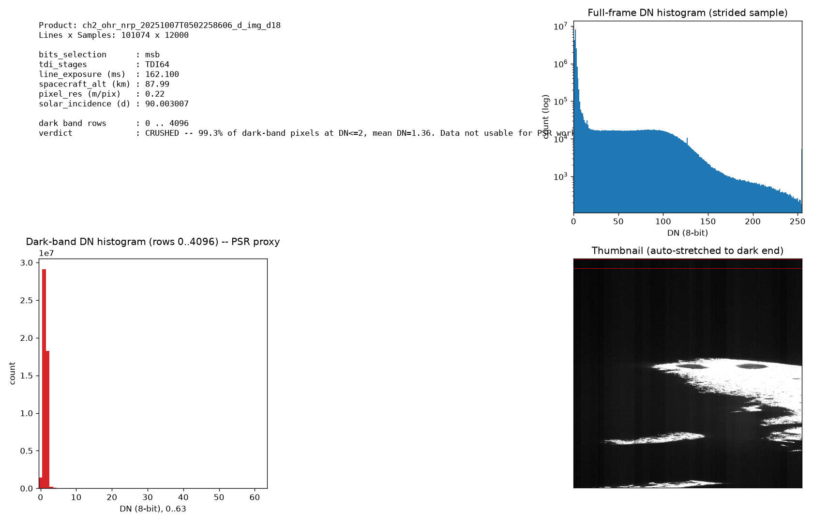
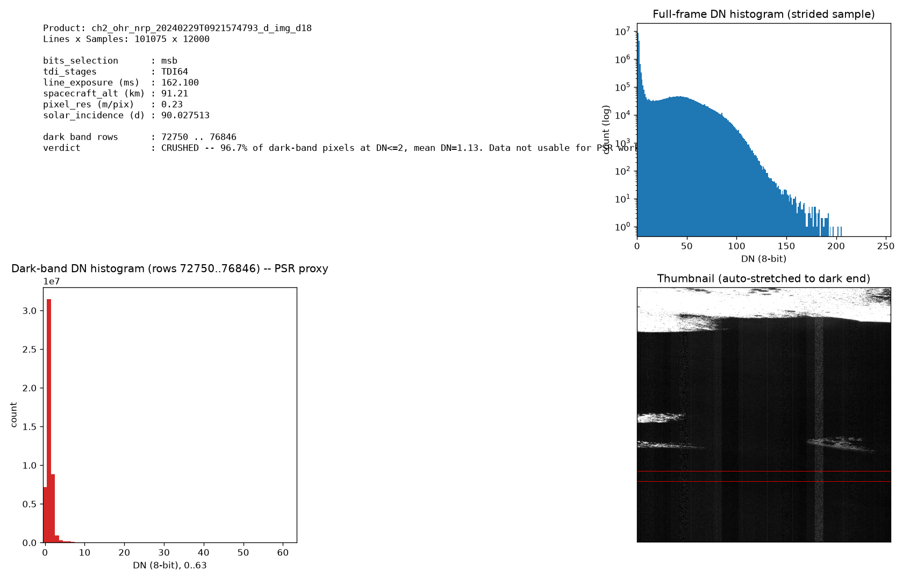
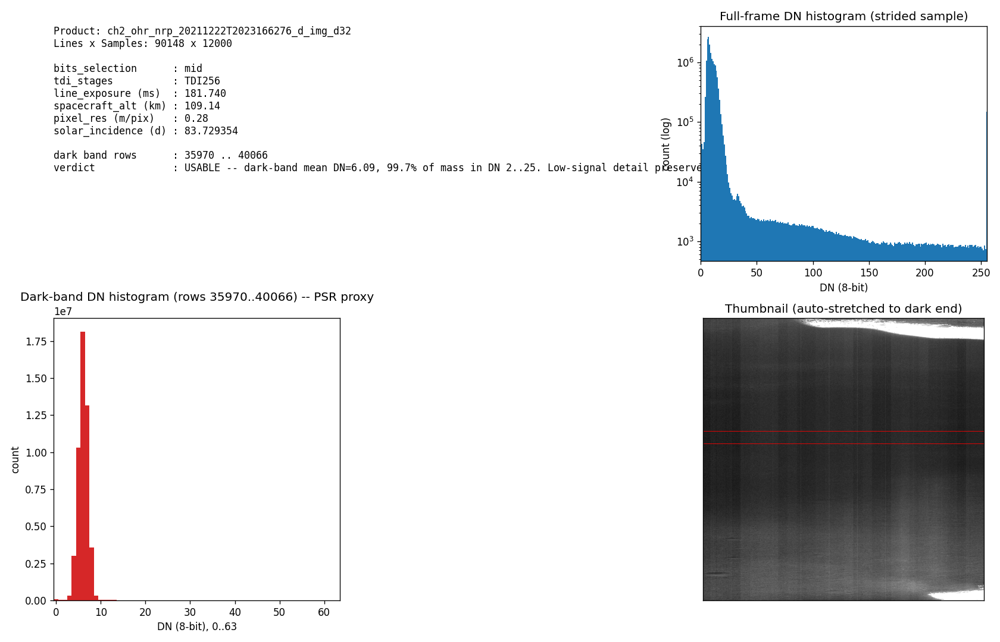
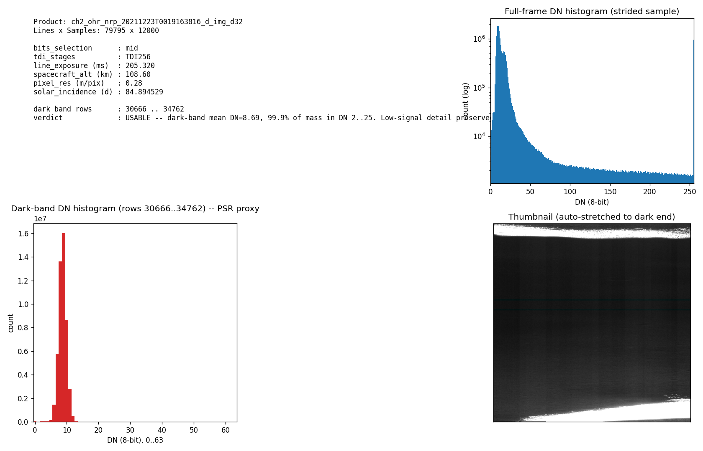

# Findings from the OHRC raw-product audit

A short empirical record of what I learned from indexing and
inspecting all OHRC raw products available on PRADAN at the time of
writing. Numbers in this document are measured, not estimated.

These findings inform what kinds of denoising / restoration tasks are
actually tractable from the existing OHRC archive; they are deliberately
neutral about the wider project's target.

---

## Corpus shape

`python -m catalog summary` over the 312 raw products downloaded from
PRADAN:

| Quantity | Value |
|---|---|
| Raw products indexed | 312 |
| Unique observations | 301 |
| Dual-station downlinks | 11 groups (verified byte-identical) |
| Date range | 2019-09-06 → 2026-03-31 |
| Latitude coverage | -89.98° to +85.64° |
| Truncated / corrupt downloads | 0 |

By **bits_selection** (which 8 bits of the 10-bit ADC the archive keeps):

| value | count |
|---|---|
| `msb` (upper 8 bits) | 303 |
| `lsb` (lower 8 bits) | 7 |
| `mid` (middle byte) | 2 |

By **TDI stages** (the N parameter for the noise model):

| value | count |
|---|---|
| `TDI64` | 302 |
| `TDI128` | 8 |
| `TDI256` | 2 |

By **area** as tagged in the PDS4 label:

| value | count |
|---|---|
| South Pole | 273 |
| Equatorial | 36 |
| (unset) | 3 |

By **ground station** that received the downlink (the trailing token in
each filename is the station, not a release variant — verified against
the OHRC PDS4 User Guide):

| station | count |
|---|---|
| `d18` | 256 |
| `n18` | 25 |
| `d32` | 23 |
| `hw1` | 6 |
| `gds` | 1 |
| `g26` | 1 |

---

## Geometric quirks worth recording

### Dual-station observations are byte-identical

11 observations are present in the corpus twice, once per receiving
ground station. All 11 pairs have matching declared file sizes; 5 were
spot-checked by full-file md5 — all matched. Practical consequence: it
is safe to de-duplicate by observation ID when building any downstream
sample set, and the `--unique-obs` CLI flag does this for you.

### Antimeridian crossers exist (a few)

Five strips have footprints that cross the 0°/360° longitude line.
Naively computing a longitude bbox as `[min(corner_lons), max(corner_lons)]`
inverts these footprints. The catalog represents longitude as a
*cyclic arc* on `[0, 360)` instead, derived from the four corners by a
largest-gap-complement construction. The implementation is
unit-tested in `tests/test_geometry.py`.

### Near-pole strips have geometrically-degenerate longitude

At latitudes more poleward than about -88°, a single strip can span a
huge longitude range without crossing the antimeridian — longitude is
degenerate at the pole. 30 strips in the corpus fall in this regime
and are tagged `polar_degenerate = True` so that longitude-based
spatial queries can either exclude them explicitly or fall back to
lat-only filters.

---

## The headline finding: bits_selection encoding versus PSR signal

The 8-bit OHRC archive can preserve either the lower 8 bits, the middle
byte, or the upper 8 bits of the detector's 10-bit ADC, depending on a
per-observation `bits_selection` flag. For terrain receiving only
secondary illumination — the conditions inside a Permanently Shadowed
Region — the photon flux is low enough that the *lower* 8 bits are
where any signal lives. **MSB encoding discards exactly that range.**

The corpus distribution is 303 MSB / 7 LSB / 2 MID, i.e. **97% MSB**.
Worse, the 40 strips that satisfy the PSR illumination condition
(`solar_incidence ≥ 90°`) are *all* MSB.

I tested whether MSB encoding still leaves any usable structure in
the dark band by running a pixel-level diagnostic on three of these
strips. The procedure picks the darkest contiguous band of rows in
each image (a per-strip proxy for the PSR-conditions region without
needing georeferencing), histograms the DN values in that band, and
applies a published criterion to label each strip USABLE / MARGINAL /
CRUSHED.

| Strip | bits | TDI | dark-band % at DN ≤ 2 | mean DN | verdict |
|---|---|---|---|---|---|
| `ch2_ohr_nrp_20251007T0502258606_d_img_d18` | msb | TDI64 | 99.3% | 1.36 | CRUSHED |
| `ch2_ohr_nrp_20240229T0921574793_d_img_d18` | msb | TDI64 | 96.7% | 1.13 | CRUSHED |
| `ch2_ohr_nrp_20240229T0921593215_d_img_d18` | msb | TDI64 | 96.7% | 1.13 | CRUSHED |

All three exceed the CRUSHED threshold (>95% of dark-band mass at
DN ≤ 2, mean DN < 1.5). The two `20240229T0921...` strips are
sequential exposures from the same orbital pass (timestamps two
seconds apart), and their identical dark-band histograms confirm the
verdict is geometric, not stochastic.

By contrast, the two `mid`-encoded strips at the same general region
(lon ~310–312°E, lat ~-84.9°) carry a usable dark-band signal — mean
DN ≈ 5–7, distributed across DN 2–25 — but they are imaged under
sunlit illumination (solar_incidence 83.7° and 84.9°), not PSR
conditions. They are the only mid-encoded products in the corpus that
cover this region.

### Plots

The diagnostic figures below are auto-generated by
`analysis/diagnose_bits_selection.py` and
`analysis/check_msb_psr_usability.py`. Each panel includes the strip's
metadata, a full-frame log-scale DN histogram, the darkest-band DN
histogram (0–63 zoomed), and a thumbnail with the chosen dark-band
rows marked.

**MSB-encoded PSR strips — dark band is crushed to DN 0–2:**





**MID-encoded sunlit strips at the same region — dark band has spread:**




---

## What this means for what's tractable

This is not a project-defining negative result — it's a concrete data
constraint that shapes what kinds of denoising experiments the
existing corpus can support.

- **Training a denoiser on real OHRC PSR pixels is not currently
  possible** from this archive: the only strips that meet the PSR
  illumination criterion are MSB-encoded and the signal has been
  truncated by the encoding before it ever reaches us.
- **Sunlit polar strips are still usable as a noise-model anchor.**
  The 7 LSB strips (scattered geographically, none at PSR conditions)
  carry full 8-bit dynamic range and can support Photon Transfer Curve
  estimation for the OHRC detector.
- **Two `mid`-encoded sunlit strips share the same polar region and
  imaging geometry.** Whatever the project's eventual target, this
  pair gives us a small, controlled set on which to validate noise
  injection, illumination rescaling, and any other physics-driven
  data-augmentation pipeline before scaling.
- **A synthetic training pipeline** — sunlit OHRC → rescale to
  PSR-equivalent brightness via DEM-based ray tracing → inject
  physically calibrated noise → train denoiser — is the path that
  doesn't depend on the missing low-signal real data. Whether this is
  the right path for the project is a separate decision.

---

## Reproducing

The diagnostics that produced everything in this document are
self-contained Python scripts under `analysis/`:

```bash
# Long-form bbox geometry test (writes analysis/bbox_diag.jsonl)
.venv/bin/python analysis/diagnose_bbox.py

# File-size + dual-station byte-identity check
.venv/bin/python analysis/diagnose_truncation_and_dedup.py

# Dark-band DN diagnostic on the two MID Cabeus-region strips
.venv/bin/python analysis/diagnose_bits_selection.py

# Apply the same dark-band check to three MSB PSR-condition strips
.venv/bin/python analysis/check_msb_psr_usability.py
```

The catalog summary that produced the corpus-level counts:

```bash
.venv/bin/python -m catalog build /path/to/ohrc-data
.venv/bin/python -m catalog summary
```

OHRC raw products live in PRADAN
(<https://pradan.issdc.gov.in/ch2/>); the per-strip details cited above
are reproducible from the PDS4 labels in each product directory.
